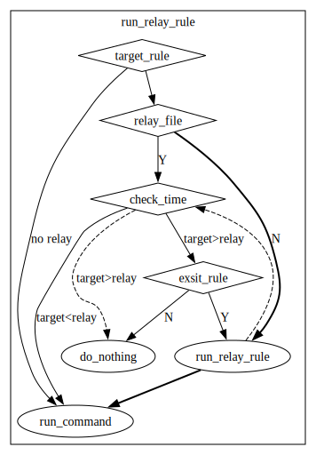

# smake
Simple make but with message.  

## Feature
  * [x] print message when rules finished.
  * [ ] run specified rule.
  * [ ] track modified files
  * [ ] different message in different status.

## Quick Start
run command `c++ smake.cpp -o smake` and prepare a `Makefile`, then run `./smake`.

## Process

